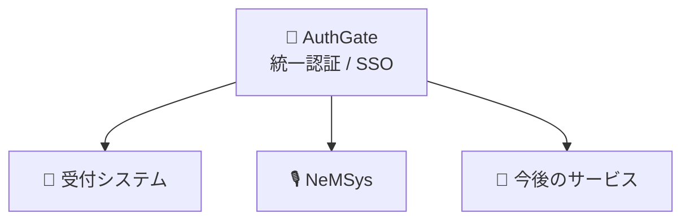

# 🏢 Comic Market Kannai

**コミックマーケット準備会 館内担当 Web チーム**

スタッフ活動を支えるシステムを、少人数で開発・運用しています。

---

## 🧭 私たちについて

世界最大級の同人誌即売会「コミックマーケット」。その会場内を担当する **館内担当** のスタッフ活動を、Web の力でちょっとずつ便利にしていくチームです。

現場で本当に使われるものを、現場を知るスタッフ自身の手で。それが私たちの開発スタイルです。

## 📦 プロジェクト

| | プロジェクト | 概要 | 状態 |
| :-: | --- | --- | :-: |
| 🎫 | **受付システム** | サークルの出欠・受付を管理する中核システム | 🔄 v2 へリプレイス中 |
| 🔐 | **AuthGate** | スタッフ向けの統一認証（SSO）基盤 | 🚧 開発中 |
| 🎙️ | **NeMSys** | ヒアリング内容を録音から自動でデジタル化するネゴ管理システム | 🚧 開発中 |
| 🌐 | **館内 Web** | 館内担当の実務を支える業務 Web | ✅ 稼働中 |
| 🚦 | **混雑管理ほか** | 混雑管理などの補助ツール群 | 💡 構想中 |

> [!NOTE]
> 各リポジトリはスタッフ活動に関わるため、原則として **private** で運用しています。

## 🛠️ 技術スタック

新規開発は **TypeScript / Python** を軸に、少人数でも保守しやすい構成を心がけています。

| 領域 | 主な採用技術 |
| --- | --- |
| バックエンド | FastAPI (Python) / Hono (TypeScript) |
| フロントエンド | React (PWA) / SvelteKit / Angular |
| データベース | PostgreSQL |
| インフラ | Docker（自前サーバー運用） |
| AI 活用 | 音声文字起こし + LLM による入力支援 |

## 🤝 参加するには

開発はコミックマーケット準備会の館内担当スタッフが行っています。興味のある方は、まずはコミックマーケットのスタッフ活動から！

## 🔗 リンク

- 🏠 [コミックマーケット公式サイト](https://www.comiket.co.jp/)

---

🧡 現場のために、現場の手で。

